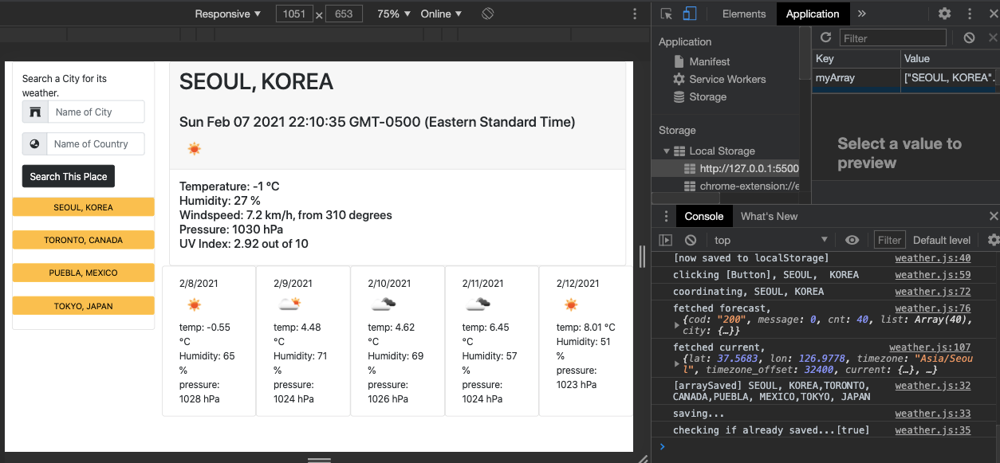

# Homework5

**Deployed application URL**
https://talkingskunk.github.io/weatherDashboard/

**GitHub Repository URL**
https://github.com/TalkingSkunk/weatherDashboard/

## Table of Contents

* [Description](#description)
* [Installation](#installation)
* [Usage](#usage)
* [Credits](#credits)
* [License](#license)
* [Badges](#badges)
* [Features](#features)
* [Contributing](#contributing)
* [Tests](#tests)

## Description 

**What was the problem?**
- I would like to what the weather is like in my desired place.

**What would be the foreseeable consequences of the problem?**
- I want to see the search history of my places all in one website.

**What were your goals?**
- To create a working weather forecast dashboard.

**What have you done about it?**
- Withdraw from 2 "api.openweathermap.org" APIs for:
    - current weather, and
    - 5-day forecasts.
- Display the current time and the real-time weather.
- Save the User's search history.
- Allow the User to fast-search from previously searched places.

## Installation

All you need is a working computer or a smartphone, and access to Internet!

## Usage 

Search for your desired place for the weather forecasts.

## Credits

@Fil
@Luca B

**Tutorials**

* https://developer.mozilla.org/
* https://stackoverflow.com/

## License

MIT License

Copyright (c) [2021] [Sam Kim]

Permission is hereby granted, free of charge, to any person obtaining a copy
of this software and associated documentation files (the "Software"), to deal
in the Software without restriction, including without limitation the rights
to use, copy, modify, merge, publish, distribute, sublicense, and/or sell
copies of the Software, and to permit persons to whom the Software is
furnished to do so, subject to the following conditions:

The above copyright notice and this permission notice shall be included in all
copies or substantial portions of the Software.

THE SOFTWARE IS PROVIDED "AS IS", WITHOUT WARRANTY OF ANY KIND, EXPRESS OR
IMPLIED, INCLUDING BUT NOT LIMITED TO THE WARRANTIES OF MERCHANTABILITY,
FITNESS FOR A PARTICULAR PURPOSE AND NONINFRINGEMENT. IN NO EVENT SHALL THE
AUTHORS OR COPYRIGHT HOLDERS BE LIABLE FOR ANY CLAIM, DAMAGES OR OTHER
LIABILITY, WHETHER IN AN ACTION OF CONTRACT, TORT OR OTHERWISE, ARISING FROM,
OUT OF OR IN CONNECTION WITH THE SOFTWARE OR THE USE OR OTHER DEALINGS IN THE
SOFTWARE.

## Badges

- 
- 
- 
- 
- 
- 

## Features

- You can search by city and country.
- You can click on the previously searched places to pull data quickly.
- You can find informed weather data in each place in real-time.

## Contributing

[Contributor Covenant](https://www.contributor-covenant.org/version/2/0/code_of_conduct/code_of_conduct.md)

## Tests

Console.log

&copy; 2021 Sam Kim
